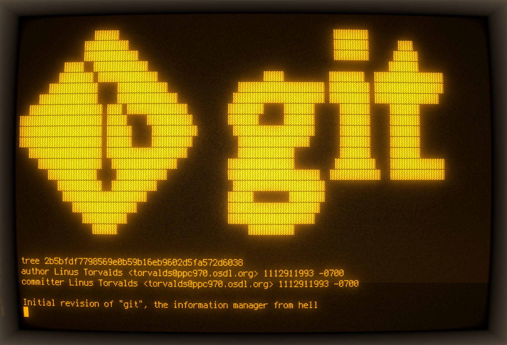

+++
date = '2025-09-13'
draft = false
title = "Git’s hidden simplicity"
subtitle = "What’s behind every commit"
toc = false
+++

Many programmers would admit this: our knowledge of Git tends to be pretty…
superficial. “Oops, what happened? Screw that, I’ll cherry pick my commits and
start again on a fresh branch”.

I’ve been there. I knew the basic use cases. I even thought I was pretty
experienced after a hundred or so resolved merge conflicts. But the confidence
or fluency somehow wasn’t coming. It was a hunch: learned scenarios, commands
from Stack Overflow or ChatGPT, trivia-like knowledge without a solid base.

In software engineering, you don’t need to have *all the knowledge*: you just
need to *quickly identify and fetch the missing bits of knowledge*. My goal is
to give you that low-level grounding to sharpen your intuition. Git isn’t
really complicated in its principles!

Disclaimer: I am not a Git expert either. Let’s learn together.

## In the beginning, there were hashes.

Do you know how *commit hashes* are generated? I have to admit, I thought for a
while that those hashes were somehow randomized. After all, I can run `git
commit --amend`, change nothing, and still get the same commit, but with a new
hash, right? Likewise, `cherry-pick`ing the same commit onto another branch
gives me yet another hash.

Boy, I couldn’t be more wrong. The commit hash is literally just a SHA-1
checksum of the information that constitutes the commit. So two identical
commits have identical hashes. Let’s look what a commit consists of. Run the
following command:

    $ git --no-replace-objects cat-file commit HEAD

*(In case you don’t know: HEAD resolves to the commit you currently checked
out)*. Let’s call the output of this command the payload. For example, the
payload might be:

    tree a55ff598781e0c7870fa5c87154a7b731b1c3336
    parent c1f4476718c232f4fd8d24cf6249e42995734abc
    author Przemysław Kusiak <mail@allvpv.org> 1757612521 +0200
    committer Przemysław Kusiak <mail@allvpv.org> 1757612563 +0200

    nushell: short `git status` (`-s`) by default, remove ambiguity, scale factor

That’s it. That’s the full commit. Then prepend the following
**null-terminated** string to the `payload`: “`commit 298`”, where `298` is the
size of the payload in bytes. Compute a SHA-1 over the result and boom: you’ve
got a Git commit hash! Try it yourself:

    $ git --no-replace-objects cat-file commit HEAD > payload
    $ printf "commit %s\0" $(wc -c < payload) > payload_with_header
    $ cat payload >> payload_with_header
    $ sha1sum payload_with_header

Now compare the output to the actual commit hash:

    $ git rev-parse HEAD

It works. So simple. Now, let’s ponder what the `payload` contains:

1. `tree` – the hash of a tree object. More on trees later; for now, think of
   it as a snapshot of all files in the repo.
2. `parent` – a hash of parent commit(s).
3. `author`, `committer` – self-explanatory, but notice that they include date
   (seconds since the Unix epoch) and time zone; [in several scenarios it’s
   possible that the author is not the
   committer](https://stackoverflow.com/a/6755848).
4. the commit message.

## Aha!

We are not hashing the **diff** a commit introduces. Rather, the commit
**header**, together with the referenced **tree** and **parent**, determines
the hash.

And now it’s easy to see what happens when you run `git commit --amend` and
change “nothing”. Something still changes: the date in the `committer` field!
(Note that `git show` doesn’t display the committer; the date you see comes
from the author field). But if you are fast enough to amend within the same
second as the original commit, the commit hash remains unchanged!

And on a `cherry-pick`, the parent field changes, and usually, though not
always, the tree field as well.

> If you’re a careful reader, you might wonder what the parent field is for the
> first commit in a repo, and for a merge commit. What do you think? Grab a
> repo and verify.

## So cool! But what is a tree?

We saw that a commit references a tree. Let’s check what it really is:

    $ tree_hash=a55ff598781e0c7870fa5c87154a7b731b1c3336
    $ git cat-file tree $tree_hash

Oops, the `payload` isn’t human-readable text; it’s binary data. But just like
with commits, if you prepend “`tree <payloadSize><NUL>`” to the payload bytes,
you can compute the tree’s hash from the result!

Fortunately, Git lets you pretty-print a tree’s contents:

    $ git cat-file -p $tree_hash
    100644 blob b9768f0236f3d932e680f1edfca69f2d8de776b8    .gitconfig
    100644 blob d960f12b4f187ee82d7a1ac545e6452ebb9c2d5b    .gitignore
    100644 blob 2bb1c65b1090c881adc201d78ea2654d575146ea    README.md
    100644 blob a26fd7ac25e457c22af2f2436aac581b50b0558a    bashrc
    040000 tree 4572efa73b2d3d822ef76b6771a2dc4f9a22772a    bin
    100755 blob b9956764ddc570a78d5daa825c6b0ad4cafbc26e    bootstrap.sh
    040000 tree ad5b3107519883dad04997e0e1161ddbb392fc63    keyboard
    040000 tree eea34f8abc6358d88ca654774dd00d8bca32fa58    lumber
    040000 tree cfea0128ab25dfd83ec43f035adfe71ab1e18583    neovide
    040000 tree b2504f0e9c082f5a04d07c3eb41116fecb821e7d    nushell
    040000 tree 6eb525af45a6f346c34a9add71600c6b8a5c9729    nvim
    100644 blob 287ee75ab7c9fea8995c9219e8f90b08ba457134    screen.png

A `tree` is just like a directory: it references other files (blobs) and
directories (trees) nested inside it. It looks a bit like ls output. The first
column records, of course, the Unix file permissions.

## As for the blob, you can probably already guess what it is.

Nothing more, nothing less than the raw file content – no metadata. And yes,
prepend null-terminated “`blob <file_size>`” to the bytes, run sha1sum, and
you’ll get the blob’s hash!

## Nothing redundant is stored.

No extra metadata such as file modification time: that can be inferred from
commit history. **A simple and immutable structure**: you can’t change a commit
without changing its hash.

And if you think about it, you will notice that it is a…

## ...Directed Acyclic Graph (DAG)

There are three types of nodes in this graph: commits, trees, and blobs. And four types of edges:

- **commit -> commit** – parent relationship; a commit has zero or more parents (usually one).
- **commit -> tree** – each commit points to exactly one tree (a snapshot of files and folders).
- **tree -> tree** – subdirectory relationship.
- **tree -> blob** – files contained in a directory.

Interestingly, the graph fragment reachable from a **tree** node doesn’t have
to form a strict tree. For example, a single blob can be referenced by multiple
parents.

## What about branches?

As you probably know, a branch is just a ref pointing to a commit hash. If you
run this in your repo root,

    $ ls .git/refs/heads/

you’ll see all local branches as file names, each file just a few bytes, with
the referenced commit’s hash inside. Likewise, `.git/refs/remotes/origin/`
directory contains pointers to the remote-tracking branches.

So you can think of branches as labels for commit histories. If you commit on
main:

- the new commit will have the hash pointed to by `main` as its parent field;
- then the `main` branch label will be updated to point to the new commit’s hash.

And the `.git/HEAD` file contains the name of the current branch – or commit
hash, if you’re in a detached state. This special pointer tells Git what is
currently checked out.

## That’s it for today.

I hope this clarifies your mental model and clears some of the mystery around
Git. The building blocks are simple. Now you shouldn’t have a problem answering
questions such as:

1. How are Git commit hashes generated? Why does rebasing produce different
   commit hashes?
2. Can a remote-tracking branch update without your local branch updating?
3. Which data structure represents the repository? What are the node and edge
   types in this DAG, and how do they relate?

In the next articles, I plan to cover more advanced concepts, such as Git
object storage, garbage collection, and how the default merge strategy works.



If you have a little more time and want to keep going, I recommend a few
resources:

- [Pro Git Book](https://git-scm.com/book/en/v2): very practical, but it
  doesn’t lack depth; look at the **[Git Internals](https://git-scm.com/book/en/v2/Git-Internals-Plumbing-and-Porcelain)**
  section.
- [Git for Computer Scientists](https://eagain.net/articles/git-for-computer-scientists/) by
  Tommi Virtanen; short and sweet: this is where I got the DAG analogy.
