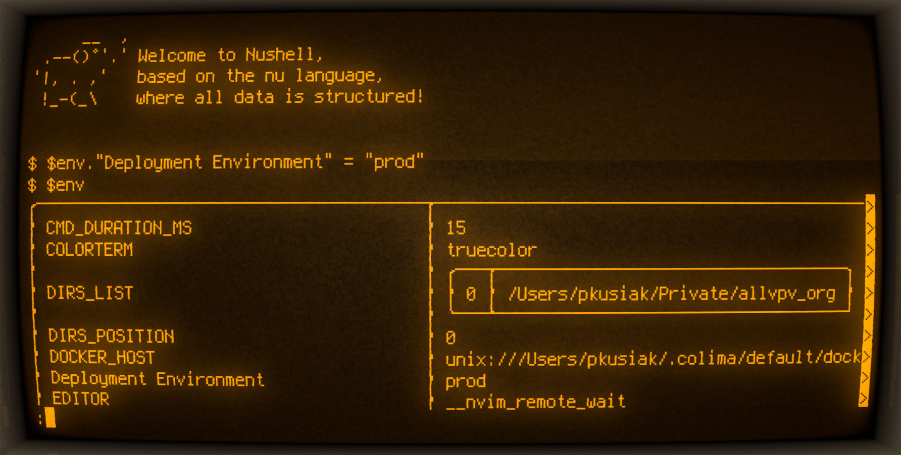

+++
date = '2025-09-20'
draft = true
title = "Environment variables are a legacy mess"
toc = false
+++


<!-- This is a draft. It should be ignored by Hugo, and not displayed on the website. -->
<!-- This is a draft. It should be ignored by Hugo, and not displayed on the website. -->
<!-- This is a draft. It should be ignored by Hugo, and not displayed on the website. -->
<!-- This is a draft. It should be ignored by Hugo, and not displayed on the website. -->
<!-- This is a draft. It should be ignored by Hugo, and not displayed on the website. -->
<!-- This is a draft. It should be ignored by Hugo, and not displayed on the website. -->
<!-- This is a draft. It should be ignored by Hugo, and not displayed on the website. -->

In software engineering, the new often meets the old, and some things never
change for decades. Even though programming languages have rapidly evolved, the
overall scaffolding that OS gives for running the processes has been pretty
much the same since the days of Unix.

If you need to somehow parametrize your application at runtime by passing a
couple of ad-hoc variables (without creating temporary files or using some
custom solution involving IPC), you are doomed to use pretty awkward and
outdated interface:

## Environment variables (envvars).

There is no namespace to it, no types. Just a flat, embarassingly global
dictionary of strings.

### And they are everywhere.

Even a novice programmer is supposed to know them. (They saw it at some point,
maybe during a local setup that required exporting the `SECRET_API_KEY`, or
while building a Docker image).

But what really are those envvars? Is it some kind of a special map inside the
operating system? If no, then who owns them and how do they propagate? And what
can be stored inside them?


## Where do they come from?

In a nutshell: They are passed from parent to child.

```
    841 ?        00:00:00 sshd
   1520 ?        00:00:00  \_ sshd-session
   1616 ?        00:00:00      \_ sshd-session
   5521 pts/0    00:00:00          \_ bash
   5545 pts/0    00:00:00              \_ nu
   5549 pts/0    00:00:00                  \_ bash
   5560 pts/0    00:00:00                      \_ ps
```

In Linux, a program must use `execve` syscall to execute another program. When
typing `ls` in `bash`, as well as using `subprocess.run` in Python, or, at a
higher level, launching the code editor or web browser -- it all comes down to
`execve`, preceeded by `fork`. The familiy of `exec*` C functions also uses
`execve` underneath. And `execve` takes three arguments:

```c
SYSCALL_DEFINE3(execve,
		const char __user *, filename,
		const char __user *const __user *, argv,
		const char __user *const __user *, envp)
```

So, for `ls -lah` invocation in the terminal:
- the 1st argument will be `/usr/bin/ls`, the executable path,
- the 2nd argument will be `['/usr/bin/ls', '-lah']`, the array of command line
  arguments (the executable is usually the "zero" argument),
- the 3rd argument will be, for example `['PATH=/bin', 'USER=allvpv']`: the
  array of envvars, much longer in real life.

The default convention is to pass all envvars from the parent process to the
child process. However, nothing prevents the parent process from passing a
completely different (or even empty) set of envvars when using the `execve`
system call!

By default, however, all tooling passes the environment down: `bash`, as well
as Python (when you use `subprocess.exec`), or C library `execl` function, etc.
And this is what you expect to happen: the variables are inherited by the child
processes. That's the point – to keep track of the *environment*.

> Which tools do *not* explicitly pass the environment down?
>
> For example, the `login` executable, which is used when signing onto a
> system, sets up a fresh environment for it's child processes.


## Where are they going?

After running the new program, the kernel just dumps the variables to the
memory on stack. It's just a sequence of null-terminated envvar definitions (if
you don't have a background in C, think of it as one big immutable `string`):

    00000000: 484f 4d45 3d2f 0069 6e69 743d 2f73 6269  HOME=/ init=/sbi
    00000010: 6e2f 696e 6974 004e 4554 574f 524b 5f53  n/init NETWORK_S
    00000020: 4b49 505f 454e 534c 4156 4544 3d00 5445  KIP_ENSLAVED= TE
    00000030: 524d 3d6c 696e 7578 0042 4f4f 545f 494d  RM=linux BOOT_IM
    00000040: 4147 453d 2f76 6d6c 696e 757a 2d36 2e31  AGE=/vmlinuz-6.1
    00000050: 342e 302d 3333 2d67 656e 6572 6963 0064  4.0-33-generic.d
    00000060: 726f 705f 6361 7073 3d00 5041 5448 3d2f  rop_caps= PATH=/
    00000070: 7573 722f 6c6f 6361 6c2f 7362 696e 3a2f  usr/local/sbin:/
    00000080: 7573 722f 6c6f 6361 6c2f 6269 6e3a 2f75  usr/local/bin:/u
    00000090: 7372 2f73 6269 6e3a 2f75 7372 2f62 696e  sr/sbin:/usr/bin
    000000a0: 3a2f 7362 696e 3a2f 6269 6e00 5057 443d  :/sbin:/bin PWD=
    000000b0: 2f00 726f 6f74 6d6e 743d 2f72 6f6f 7400  / rootmnt=/root

This static layout cannot be easily modified or extended: the program has to
copy those variables into some internal data structure.

Let's explore what underlying structure is used for storing the envvars in some
most essential programming tools/languages/frameworks. Out of curiosity, I've
checked the source code of them and came up with a brief description.

### Bash

It stores the variables in a ***hashmap***. Or, to be more precise, in a
***stack of hashmaps***. When you execute a process inside `bash`, `bash`
traverses the stack of hashmaps to check which variables are marked as
environmental, and copies them into an array passed to the child process.

> *Side note:* Why the stack is needed?
>
>  Each function invocation in `bash` creates a new local scope – a new entry
>  on the stack. If you declare your variable with `local`, it then ends up in
>  this locally-scoped hashmap.
>
> What's interesting is that you can export a `local` variable too! All
> subsequent processes executed inside this function will inherit this
> variable. (That is, it will be passed to them as envvar). And when the
> function exits, the variable is, of course, dropped.
>
> ```
> function localyScoped() {
>     local PATH="$PATH:/opt/secret/bin"
>     export PATH
>     env           # <- sees the PATH with /opt/scecret/bin
> }
>
>
> localyScoped
> env               # <- sees the PATH without modification
> ```
>
> I would never have learned this without diving into the source code of
> `bash`. My intuitive (wrong) assumption was that `export` *automatically
> makes the variable global*, like `declare -g`! Super interesting stuff.

### The default C library on Linux: `glibc`

`glibc` creates a dynamic `environ` array; this array can be managed by
`putenv` and `getenv` library functions.

So the time complexity of `getenv` and `putenv` is *linear* regarding the
number of envvars. Remember – envvars are not a high-performance dictionary and
you should not abuse them.

### Python

Python is an interesting case: it tightly couples it's environment to the C
library, which may lead to some unexpected problems.

If you programmed some Python, you've probably encountered the `os.environ`
dictionary.
On startup, the `os.environ` dictionary is built from the C library `environ`
array which is mentioned above.

But the dictionary values are **NOT** the “ground truth” of environment
variables for the child processes. Rather, each change to `os.environ` calls
the low-level, natively implemented `os.putenv` function, which in turn, calls
`putenv` from the C library.

> Note that the propagation is one-directional: modifying `os.environ` will call
> `os.putenv`, but not the other way around. Call `os.putenv`, and `os.environ`
> won't be updated.


## Liberal format

The Linux kernel, as well as the most popular standard C library on Linux -
`glibc` – is very liberal when it comes to the format of environment variables.

For example, your C program (if it uses `glibc`) can manipulate environment –
the global `environ` array – in such a way that you'll create several
environment variables with the same name but of a different value. And when you
execute a child process, it will also retain this "broken" setup.

You don't even need the equal sign, separating the name from the value! The
usual entry is `NAME=VALUE`  but nothing prevents you to add
`NONSENSE_WITH_EMOJI 😀` to this array. (Is it even a *variable* then, without
a proper name and a value)?

So the kernel will happily accept any null-terminated string as an “environment
variable” definition. It just imposes a *size* limitation:

- **Single variable**: 128Kb on a typical x64 Intel CPU. This is for the whole
  definition – name + equal sign + value. It's calculated as [`PAGE_SIZE *
  32`](https://elixir.bootlin.com/linux/v2.6.24/source/include/linux/binfmts.h#L14).
  No modern hardware uses pages smaller than 4Kb, so you can treat it as a lower bound,
  unless you need to deal with some legacy embedded systems.

- **Total**: 2MB on the *typical* machine. This limit is shared by envvars and
  the command line arguments. The calculation is a bit more complicated (see
  `execve(2)` man page):

        max(32 * PAGE_SIZE,  min(MAX_STACK_SIZE / 4,  6 Mb))

  On a typical system, the limiting factor is the `MAX_STACK_SIZE`. Remember,
  initially the envvars are stored on the stack! To prevent unpredictable
  crashes, the system allows only 1/4 of stack for the envvars.


## Quirks

But the fact that you can do something, does not mean that you should.

For example, if you execute `bash` with the "broken" setup – containing
duplicated names and entries without the `=` separator – it will deduplicate
the variables and get rid of the nonsense entries.

One interesting edge case is a space inside the variable *name*. My beloved
shell – Nushell – has no problem with the following assignment:

    $env."Deployment Environment" = "prod"

Python is also perfectly fine with it. However, if you run `bash`, it won't be
able to reference such variable: a whitespace is not allowed in the variable
name!

Fortunately, the variable won't be completely lost – bash will pass it down to
it's child processes. Bash even maintains a special hashtable – `invalid_env` –
just for that!


## The standard format

So what can be *safely* stored inside an envvar? A popular
misconception, repeated on
[StackOverflow](https://stackoverflow.com/a/2821183), and by ChatGPT, is that
[POSIX](https://en.wikipedia.org/wiki/POSIX) permits only **uppercase** envvars,
and anything beyond that is undefined behavior.

But this is seriously **NOT**
[what the standard says](https://pubs.opengroup.org/onlinepubs/9699919799/):

> *These strings have the form name=value; names shall not contain the character
> '='. For values to be portable across systems conforming to POSIX.1-2017, the
> value shall be composed of characters from the portable character set (except
> NUL and as indicated below). There is no meaning associated with the order of
> strings in the environment. If more than one string in an environment of a
> process has the same name, the consequences are undefined.*
>
> *Environment variable names used by the utilities in the Shell and Utilities
> volume of POSIX.1-2017 consist solely of uppercase letters, digits, and the
> \<underscore\> ( '_' ) from the characters defined in Portable Character Set
> and do not begin with a digit. Other characters may be permitted by an
> implementation; applications shall tolerate the presence of such names.
> Uppercase and lowercase letters shall retain their unique identities and
> shall not be folded together. The name space of environment variable names
> containing lowercase letters is reserved for applications. Applications can
> define any environment variables with names from this name space without
> modifying the behavior of the standard utilities.*

Yes, POSIX-specified utilities have uppercase envvars, but this is not
*prescriptive* for your programs. There’s no “shall”, binding your applications
to that syntax. Quite the contrary: you are *encouraged* to use lowercase
letters for you envvar, because they won't collide with the standard "system"
tools. And all POSIX-compliant applications must preserve names of the envvars:
“applications shall tolerate the presence of such names”. The only rule is that
the name cannot contain an equal sign.

But in reality, no one uses lowercase. The *proper etiquete* in software
development is to always use `ALL_UPPERCASE` env vars.

## In general, my recommendation is...

...to use `^[A-Z_][A-Z0-9_]*$` for names, and UTF-8 for values. You should not
have any problems on Linux. If you want to be super safe, instead of UTF-8
stick to the POSIX mandated PCS (which is, essentially, ASCII without control
characters).


## Wow, I really enjoyed writing this

But was it an interesting read? If so...




<!-- ## How to properly get the current username in Bash script? -->
<!---->
<!-- Recently I had to review code with this one peculiar line: -->
<!---->
<!--     EVALUATOR_NAME="${USER:-$(whoami)}" -->
<!---->
<!-- My first question was: isn't it redundant? Why cannot we stick to either -->
<!-- `${USER}` or `$(whoami)`? If you struggle to understand this syntax let me -->
<!-- unpack it: `${USER}` resolves to the value of the environment variable called -->
<!-- `USER`, which – surprise! – should be set to your username. And `whoami` is a -->
<!-- binary that, when executed, that prints the current username. `$(...)` captures -->
<!-- command standard output, so `echo $(whomai)` is the same as `whoami` -->
<!---->
<!-- And `${VAR_NAME:-fallback_value}` is another bashism. If `VAR_NAME` is set and -->
<!-- non-empty, that the value of `VAR_NAME` is used here, otherwise it fallbacks to -->
<!-- `fallback_value`. -->
<!---->
<!-- So why cannot we stick to either `${USER}` or `$(whoami)`? If in your Linux -->
<!-- terminal you'll type: -->
<!---->
<!--     env -->
<!---->
<!-- then you'll see all environment variables listed. But no one is preventing you -->
<!-- to write: -->
<!---->
<!--     unset USER -->
<!---->
<!-- and `USER` is gone. -->


<!-- ## Another options -->
<!---->
<!-- Of course, it wouldn't be UNIX if there were only two options. `${USER}` and -->
<!-- `whoami` are probably most popular, but there is also: -->
<!---->
<!-- - `logname` -->
<!-- - `: \\u; echo "${_@P}"` if you are on fairly new Bash (4.4 or newer); yes, really! -->
<!--   I had no clue what it meant where I was it for the first time, but don't worry, -->
<!--   we dive into this. -->
<!-- - `${LOGNAME}` -->
<!-- - `who am i` (yup!) -->
<!-- - `id -un` -->
<!---->
<!-- and I am pretty sure that this list is not complete. -->


<!-- I recently started doing infra work at my current company, improving crumbling -->
<!-- infrastructue for AI-related services and tools. And sometimes I wonder, what -->
<!-- went wrong with the software world that in 2025 I still have to bother writing -->
<!-- `bash`! -->
<!-- Anyway, Bash is still around, and r -->
<!---->
<!-- You know what I mean. Clever one-or-two-or-ten-liners next to the Docker -->
<!-- `RUN` directive. `sh` spliced in the Jenkins pipelines. Full-blown startup -->
<!-- script inside the image. Plus tiny `local_setup.sh` in the repo to export env -->
<!-- vars. And so on. Bash is there and it's not going anywhere! -->
<!---->
<!-- Don't get me wrong, I looove writing bash! It's the same kind of love that I -->
<!-- have for Makefiles, Objective-C, or any kind of arcane retro tech. However, -->
<!-- arguing with someone (again!) that in their `for` loop they should use -->
<!-- `${array[@]}` (instead of the default split by whitespace) feels like -->
<!-- satisfying my inner nerd instead of doing actual productive work for my -->
<!-- `$CORP`. -->
<!---->
<!-- So why bash!? -->
<!---->
<!-- In theory, I can embed inside a Docker image a modern shell like, for example, -->
<!-- my beloved Nushell. But a new 40 Mb binary would raise some eyebrows. Plus it -->
<!-- would need to pass compliance and security audit. What's worse, AI is not able -->
<!-- to output 10 syntactically correct lines of Nushell. (This is a niche -->
<!-- technology, afterall). So using Nushell for infra would paralize my colleagues -->
<!-- and make them unable to collaborate: not everyone in my team is a Nushell -->
<!-- afficionado, afterall. (Shout out to our intern Krzysiek, who is)! And don't -->
<!-- even get me started about integration with external tools, like, for example, -->
<!-- embedding Nu inside Dockerfile. -->
<!---->
<!-- Compare this to `bash` and its cute little ELF -- 2MB statically linked. Jokes -->
<!-- aside, this binary is literally everywhere. I bet it is more widespread than -->
<!-- the famous "1 billion devices running Java". And, last but not least, AI is -->
<!-- super fluent in bash. (At least in comparison to us, mere mortals). -->
<!---->
<!-- And, in a nutshell, that's why bash sticks around. -->
<!---->

<!-- Sometimes I wonder, what went wrong with the software world that in 2025 I -->
<!-- still have to write `bash`. Anyway, it is still around, at least in my -->
<!-- `${CORP}`. And I need to write or review such code from time to time. -->
<!---->
<!-- You can learn horizontally, concept by concept, but you can also learn -->
<!-- vertically, trying to tackle one thing in depth. This article has one -->
<!-- theme: getting the current username in a Bash script. And everything -->
<!-- that follows from that. -->
<!---->
<!-- Recently I had to review code with this one peculiar line: -->
<!---->
<!--     EVALUATOR_NAME="${USER:-$(whoami)}" -->
<!---->
<!-- My first question was: isn't it redundant? -->
<!---->
<!-- If you struggle to understand this syntax let me unpack it: -->
<!---->
<!-- > On Linux, `${USER}` resolves to the value of the environment variable called -->
<!-- > `USER`, which – surprise! – should be set to your username. And `whoami` is a -->
<!-- > binary that, when executed, that prints the current username. `$(...)` captures -->
<!-- > command standard output, so `echo $(whomai)` is the same as `whoami`. -->
<!-- > -->
<!-- > And `${VAR_NAME:-fallback_value}` is another bashism. If `VAR_NAME` is set and -->
<!-- > non-empty, that the value of `VAR_NAME` is used here, otherwise it fallbacks to -->
<!-- > `fallback_value`. -->
<!---->
<!-- So why cannot we stick to either `${USER}` or `$(whoami)`? -->
<!---->
<!-- Anyway, that's what Cursor generated for my colleague, and I needed to review -->
<!-- it. I asked the LLM for a possible reasoning of why this was chosen, but the -->
<!-- answer was vague and non-convincing. -->
<!---->
<!-- And I went down the rabbit hole, doing a little bit of research  :) I will be -->
<!-- focusing on how it works on Linux. -->

<!-- ## Terrible code from AI assistants -->
<!---->
<!-- You probably noticed that AI coding tools (as for now) are doing a lot of -->
<!-- overzelaous, too defensive checks and fallbacks. I imagine that reinforcement -->
<!-- learning leads to that: models are heavily trained to complete the tasks -->
<!-- against automated checker, before their context window ends, so they try -->
<!-- everything to desperately “make it work”. There is no time to “tweak” the -->
<!-- solution iteratively, if you have limited memory, so it's always better -->
<!-- to do the validation multiple times than to miss it. -->
