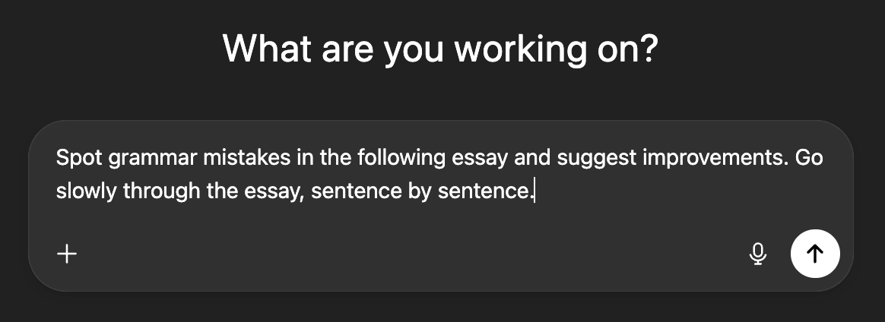

+++
date = '2025-08-30'
draft = false
title = 'Turn off Cursor, turn on your mind'
subtitle = 'A case against agentic coding'
toc = false
+++

## Two approaches to using AI

I believe that AI can *make you smarter*. It can help you grow faster,
especially when it comes to gaining new knowledge or developing new skills. It
is the perfect learning companion and a great language tutor, and it's ability
to browse the web and surface relevant links far exceeds my own. Heck, I've
even used it – albeit very modestly – to polish this draft so it's bearable to
the native speakers.

However, I would call this way of using AI – for the sake of this essay –
approach one.

- Use AI to learn faster and understand the whole system better.

That’s not the main way people – especially software engineers – use or are
expected to use AI. Let’s call the other emerging paradigm approach two.

- Using AI to tackle problems for you (so, at the end of the day, you neither
  learn much nor deepen your understanding of the system).

I think that approach 2 is the most straightforward – or let's say, the laziest
– way to use AI tools, especially agentic coding tools like Cursor or Claude
Code.

And I think it's a trap. **Unless AI systems can completely replace us, we
shouldn't let ourselves get lazy – even for promised efficiency gains**.

## Not only coding

There’s a spectrum when it comes to outsourcing tasks to AI. For example, I could:

1. Ask AI to draft this essay based on the title.
2. Ask AI to rephrase my essay to make it ChatGPT-esque.
3. Ask AI to fix the draft’s grammar.
4. Ask AI to list grammatical or stylistic issues in this essay and suggest
   improvements.

Of these four choices, the first two are detrimental to my essay; option 3
fixes it but doesn’t help me learn; and option 4 not only helps the essay but
also makes me a slightly better writer in English.

I believe the same logic holds for coding. **Because coding is an ongoing
learning process, even those in senior positions shouldn’t think they have it
all figured out**. Let me elucidate this point.



## What makes you a faster, more skilled programmer?

Let's start with something we can probably all agree on.

> A new hire generally won't perform at the same pace as someone who is fully
> onboarded into the project and has been working in it for some time.
>
> (Holds true when comparing people of similar skills and drive).

Let's say you are new to the project: you pick up a task and it takes you Y1 to
complete. Some time passes, you implemented a huge chunk of the project. Then
you take a different task *of the same complexity* as the first, and it takes
you Y2.

If you're like me, you'll agree that Y2 is smaller than Y1.

You see, programming a large project **is not a repetitive task but an ongoing
learning process**.

> When you work in a large codebase, you are essentially learning, and building a
> mind map of how the system fits together.

I'm sure you can think of a situation in which you develped a feature very
quickly – maybe in a day or two. And another, in which more trivial problem
took the same amount of time, or even longer.

For me, the differentiator was knowledge of the project and the related
technologies.

## Learning versus agentic coding

The paragraph above isn't controversial – I'd say it's something most sensible
people would agree on. What might be more controversial is the second premise:

> Agentic coding reduces the learning experience substantially.

I won't justify that with anecdotes (though I could share one in which 'vibe
coding' led to a loss of control and a lot of debugging).

Instead, I'll appeal to common sense: **learning takes time**.

## Learning takes time

You've probably heard claims that, in the dawn of AI coding, a team of three
engineers working for six months can be replaced by a single engineer over a
weekend with the help of an AI agent. Many find those claims exaggerated, but
let's assume for the sake of argument that they're true.

My question is this: who, do you think, will learn more about the underlying
system? Who will better sharpen their coding and debugging skills in a new
project with new technologies – the person who spent *three days* or the one
who spent *six months* on it?

## Slowly losing control

How many times, in the middle of a coding session, have you deleted your code
and reworked it substantially? I bet it took you some time to figure that out.
Someone might say that, with AI coding, you can spin up two prototypes in 15
minutes and discard them easily, but I'd argue that **you often can't
competently and thoroughly evaluate the AI-generated code**.

As the system grows denser and more complicated, and as AI compresses the time
you spend thinking about it, you **slowly lose control**.

If you're like me, you've probably had the unpleasant gut feeling of losing
control when coding with an AI agent. At the end of the day, **I am responsible
for the code I ship**. I can't say that an AI agent messed something up unless
the agent is also accountable for it. So I think: better to implement this
myself, and use AI to suggest improvements or explore alternatives.

## Epilogue

Maybe we'll reach a day when AI agents join our daily standups, take tasks,
ship them, and assume full responsibility. Maybe, at some point, they'll take
over coding entirely, laying us all off.

But until then, I won't entrust them with my skills, my learning, or my
responsibilities. The moment they break down, I have to take over – so I need
to know exactly what's going on in the system.



At the same time, I’m all for using AI to learn, explore alternatives, and gain
efficiency by means other than outsourcing coding to AI.
